# BotGo

QQ频道机器人，官方 GOLANG SDK銆?
[](https://pkg.go.dev/github.com/sealdice/botgo)
[](https://github.com/sealdice/botgo/tree/master/examples)

## 注意事项
1. websocket 事件鎺ㄩ€侀摼璺皢鍦?4年年底前逐步下线，后续官方不再维鎶ゃ€?2. 新的webhook事件回调链路目前在灰度验证，灰度用户可体楠岄€氳繃椤甸潰閰嶇疆浜嬩欢鐩戝惉鍙婂洖璋冨湴鍧€銆傚鏈湪鐏板害鑼冨洿锛屽彲鑱旂郴QQ机器人反馈助手开閫氥€?


灰度期间，原有机器人仍可使用websocket事件链路接收事件鎺ㄩ€併€?## 涓€銆乹uick start
### 1. QQ机器人创建与配置
1. 创建寮€鍙戣€呰处鍙凤紝鍒涘缓QQ机器了[QQ机器人开放平台](https://q.qq.com/qqbot)

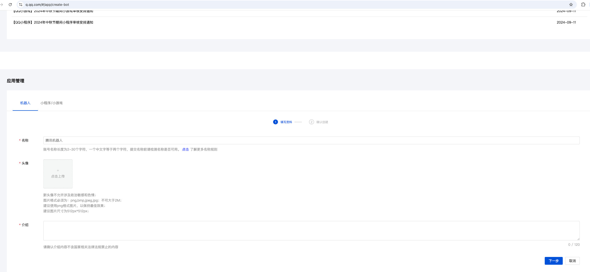

2. 配置沙箱成员 (QQ机器人上线前，仅沙箱环境可访闂?。新创建机器人会默认将创寤鸿€呭姞鍏ユ矙绠辩幆澧冦€?
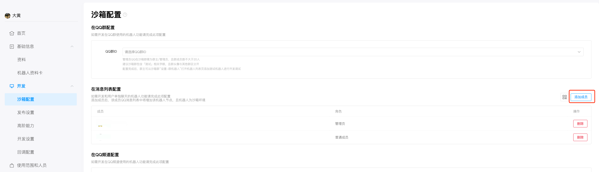

### 2. 云函数创建与配置
1. 腾讯云账号开通scf服务 [蹇€熷叆闂╙(https://cloud.tencent.com/document/product/1154/39271)
2. 创建函数

* 选择模板

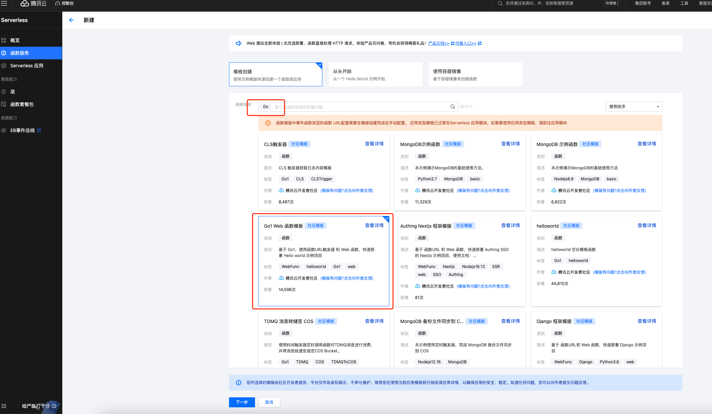

* 启用"公网访问"銆?日志鎶曢€?

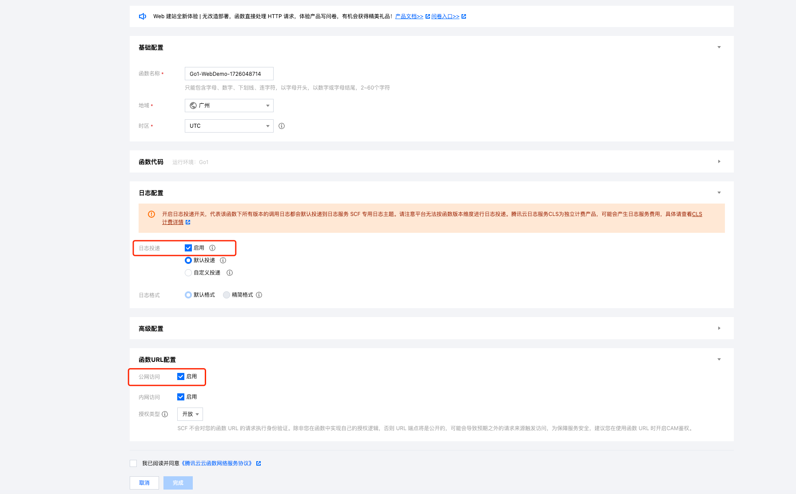

* 编辑云函数，启用"固定公网出口IP" 锛圦Q机器人需要配置IP白名单，仅白名单内服务器/容器可访问OpenAPI锛?
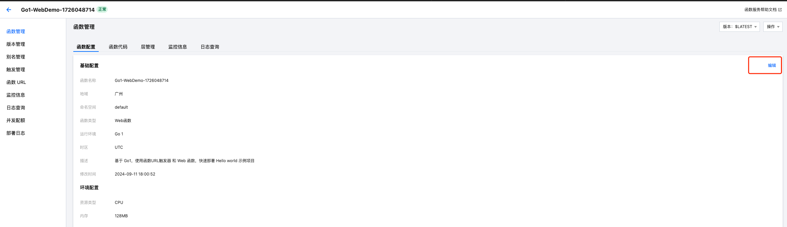

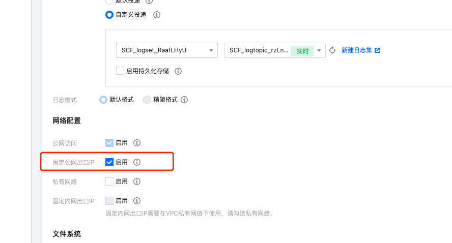

### 3. 使用示例构建、上传云函数部署鍖?1. 打开 examples/receive-and-send
2. 复制 config.yaml.demo -> config.yaml

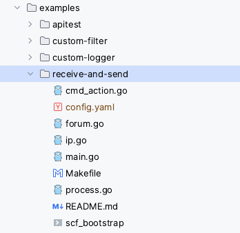

3. 登录[寮€鍙戣€呯鐞嗙](https://q.qq.com)，将BotAppID和机器人秘钥分别填入config.yaml中的appid和secret字段

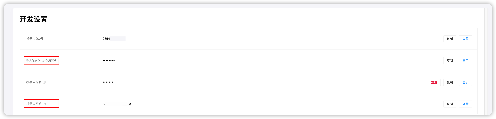

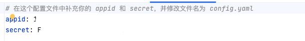

4. 执行Makefile中build指令
5. 将config.yaml銆乻cf_bootstrap銆乹qbot-demo(二进制文件打包，上传至云函鏁?
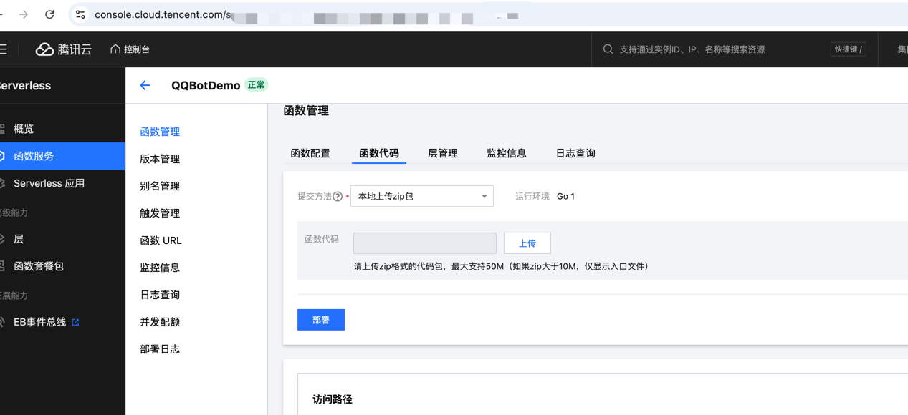

### 4.配置QQ机器人事件监鍚€佸洖璋冨湴鍧€銆両P白名鍗?
1. 复制云函数地鍧€ + "/qqbot"后缀，填入回调地鍧€杈撳叆妗嗐€傜偣鍑荤‘璁ゃ€?
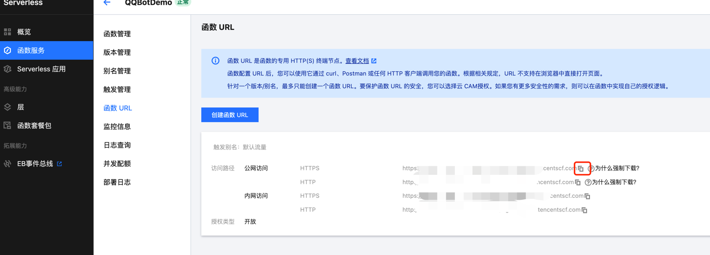

2. 鍕鹃€?C2C_MESSAGE_CREATE 事件。点击确璁ゃ€?
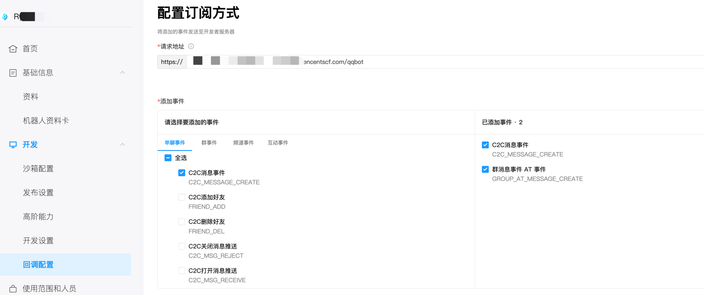


3. 将云函数 "固定公网出口IP" 配置到IP白名单中锛?
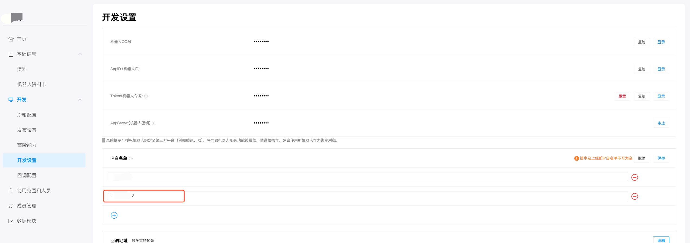

### 体验与机器人的对误
给机器人鍙戦€佹秷鎭€佸瘜濯掍綋鏂囦欢锛屾満鍣ㄤ汉鍥炲娑堟伅

## 浜屻€佸浣曚娇鐢⊿DK

```golang

var api openapi.OpenAPI

func main() {
	//创建oauth2标准token source
	tokenSource := token.NewQQBotTokenSource(
		&token.QQBotCredentials{
			AppID:     "", 
			AppSecret: "",
		}) 
	//启动自动刷新access token协程 
	if err = token.StartRefreshAccessToken(ctx, tokenSource); err != nil {
		log.Fatalln(err)
	}
	// 初始鍖?openapi，正式环澧?
	api = botgo.NewOpenAPI(credentials.AppID, tokenSource).WithTimeout(5 * time.Second).SetDebug(true) 
	// 注册事件处理函数 
	_ = event.RegisterHandlers( 
		// 注册c2c消息处理函数 
		C2CMessageEventHandler(), 
	)
	//注册回调处理函数 
	http.HandleFunc(path_, func (writer http.ResponseWriter, request *http.Request) {
		webhook.HTTPHandler(writer, request, credentials)
	}) 
	// 启动http服务监听端口 
	if err = http.ListenAndServe(fmt.Sprintf("%s:%d", host_, port_), nil); err != nil {
		log.Fatal("setup server fatal:", err)
	}
}

// C2CMessageEventHandler 实现处理 at 消息的回璋?func C2CMessageEventHandler() event.C2CMessageEventHandler {
	return func(event *dto.WSPayload, data *dto.WSC2CMessageData) error {
		//TODO use api do sth.
		return nil
	}
}
```

## 涓夈€丼DK 寮€鍙戣是(Deprecated)

请查鐪? [寮€鍙戣鏄嶿(./DEVELOP.md)

## 鍥涖€佸姞鍏ュ畼鏂圭ぞ鍖?
欢迎扫码加入 **QQ 频道寮€鍙戣€呯ぞ鍖?*銆?
![寮€鍙戣€呯ぞ鍖篯(https://mpqq.gtimg.cn/privacy/qq_guild_developer.png)
